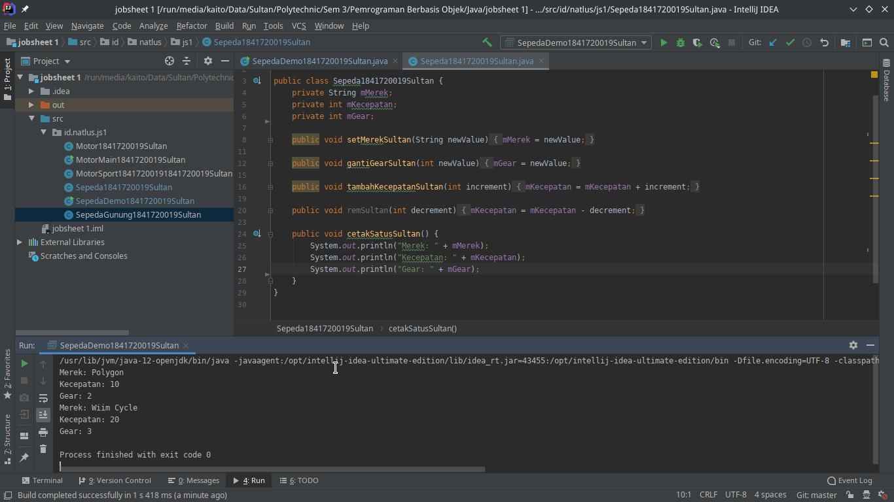
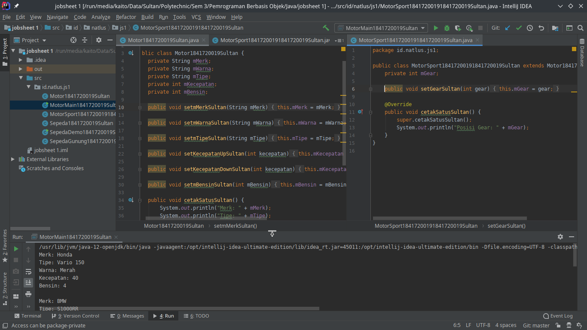
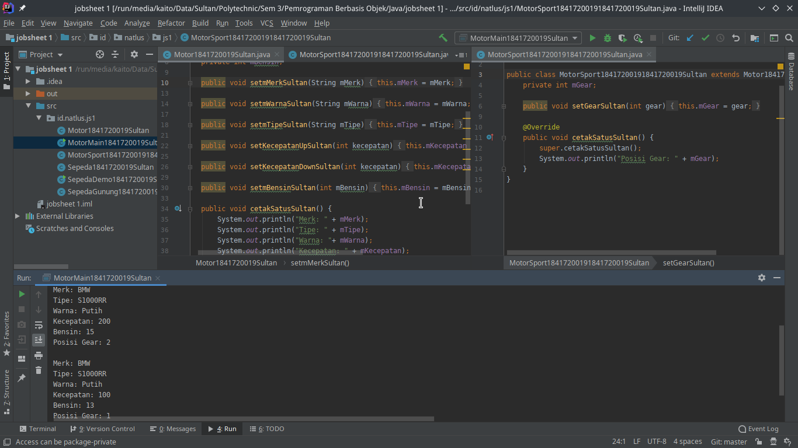

# Laporan Praktikum #1 - Pengantar Konsep PBO

## Kompetensi

Setelah menempuh materi percobaan ini, mahasiswa mampu mengenal:

1. Perbedaan paradigma berorientasi objek dengan paradigma struktural
2. Konsep dasar PBO

## Ringkasan Materi

aman santuy

## Percobaan

### Percobaan 1

Pada percobaan 1 hanya meniru apa yang ada didalam jobsheet dan mencocokkan hasilnya.

`Screenshot Percobaan 1:`


`Kode program:`

* [Sepeda1841720019Sultan.java](../../src/1_Pengantar_Konsep_PBO/Sepeda1841720019Sultan.java)
* [SepedaDemo1841720019Sultan.java](../../src/1_Pengantar_Konsep_PBO/SepedaDemo1841720019Sultan.java)

### Percobaan 2

Pada percobaan 2 hanya meniru apa yang ada didalam jobsheet dan mencocokkan hasilnya.

Mendemokan fitur inheritance pada Java OOP dengan menambahkan syntax.

``` java
... extends Sepeda1841720019Sultan{
    ...
}
```

`Screenshot Percobaan 2:`


`Kode program:`

* [Sepeda1841720019Sultan.java](../../src/1_Pengantar_Konsep_PBO/Sepeda1841720019Sultan.java)
* [SepedaGunung1841720019Sultan.java](../../src/1_Pengantar_Konsep_PBO/SepedaGunung1841720019Sultan.java)
* [SepedaDemo1841720019Sultan.java](../../src/1_Pengantar_Konsep_PBO/SepedaDemo1841720019Sultan.java)

## Pertanyaan

1. Sebutkan dan jelaskan aspek-aspek yang ada pada pemrograman berorientasi objek!

   Aspek-aspek dalam Pemrograman Berorientasi Objek
   1. Object
      * Object adalah suatu rangkaian dalam program yang terdiri dari state dan behavior, state adalah ciri-ciri atau atribut dari objek tersebut, sedangkan behavior adalah perilaku yang dapat dilakukan object tersebut.
   2. Class
      * Class adalah blueprint atau prototype dari objek.
   3. Enkapsulasi
      * Disebut juga dengan information-hiding, dalam berinteraksi dengan objek, seringkali kita tidak perlu mengetahui kompleksitas yang ada didalamnya.
   4. Inheritance
      * Disebut juga pewarisan, Inheritance memungkinkan kita untuk mengorganisir struktur program dengan natural
   5. Polimorfisme
      * Polimorfisme juga meniru sifat objek di dunia nyata, dimana sebuah objek dapat memiliki bentuk, atau menjelma menjadi bentuk-bentuk lain.

2. Apa yang dimaksud dengan object dan apa bedanya dengan class?

    Object adalah sebuah variabel yang merupakan instansiasi dari class, dan perbedaannya dengan class adalah jika class diandaikan seperti semacam blueprint-nya maka object adalah hasil dari blueprint class tersebut

    **`Contoh:`**

    Karakter game memiliki HP, MP, dan stat lainnya, maka atribut dasar seperti stat karakter game itu adalah classnya dan objek adalah karakter dimana tiap-tiap karakter memiliki atribut yang sama dari cetakannya yaitu dari class tetapi memiliki angka yang berbeda beda.

3. Sebutkan salah satu kelebihan utama dari pemrograman berorientasi objek dibandingkan dengan pemrograman struktural!

    Kelebihan PBO adalah program dapat lebih fleksibel dan modular jika ada perubahan fitur, maka dapat dipastikan keseluruhan program tidak akan terganggu. Berbeda dengan struktural, perubahan sedikit fitur saja kemungkinan dapat mengganggu keseluruhan program.

4. Pada class Sepeda, terdapat state/atribut apa saja?

    Pada class sepeda terdapat 3 atribut yaitu:
    * merek
    * kecepatan
    * gear.

5. Tambahkan atribut warna pada class Sepeda.

    Sudah ditambahkan.

    `Screenshot Pertanyaan 5:`
    

    `Kode program:`

    * [Sepeda1841720019Sultan.java](../../src/1_Pengantar_Konsep_PBO/Sepeda1841720019Sultan.java)
    * [SepedaGunung1841720019Sultan.java](../../src/1_Pengantar_Konsep_PBO/SepedaGunung1841720019Sultan.java)
    * [SepedaDemo1841720019Sultan.java](../../src/1_Pengantar_Konsep_PBO/SepedaDemo1841720019Sultan.java)

6. Mengapa pada saat kita membuat class SepedaGunung, kita tidak perlu membuat class nya dari
nol?

    Karena kita telah menambahkan syntax extends Sepeda yang berfungsi class SepedaGunung adalah turunan dari class Sepeda sehingga class SepedaGunung dapat mengakses seluruh method yang ada pada class Sepeda

## Tugas

Tugas ini dikarenakan diberi kebebasan memilih tema asalkan disekitar kita maka saya memilih tema motor.

`Screenshot Tugas:`



`Kode program:`

* [Motor1841720019Sultan.java](../../src/1_Pengantar_Konsep_PBO/Motor1841720019Sultan.java)
* [MotorSport1841720019Sultan.java](../../src/1_Pengantar_Konsep_PBO/MotorSport1841720019Sultan.java)
* [MotorMain1841720019Sultan.java](../../src/1_Pengantar_Konsep_PBO/MotorMain1841720019Sultan.java)

## Kesimpulan

Kesimpulan yang dapat saya sampaikan adalah pentingnya kita menggunakan sistem OOP (Object Oriented Programming) pada berbagai macam kode program (khususnya java) untuk membuat kita lebih mudah lagi dalam membuat program / yang lainnya.

## Pernyataan Diri

Saya menyatakan isi tugas, kode program, dan laporan praktikum ini dibuat oleh saya sendiri. Saya tidak melakukan plagiasi, kecurangan, menyalin/menggandakan milik orang lain.

Jika saya melakukan plagiasi, kecurangan, atau melanggar hak kekayaan intelektual, saya siap untuk mendapat sanksi atau hukuman sesuai peraturan perundang-undangan yang berlaku.

Ttd,

***Sultan Achmad Qum Masykuro NS***
