# Laporan Praktikum #6 - Inheritance

## Kompetensi

1. Memahami konsep dasar inheritance atau pewarisan.
2. Mampu membuat suatu subclass dari suatu superclass tertentu.
3. Mampu mengimplementasikan konsep single dan multilevel inheritance.
4. Mampu membuat objek dari suatu subclass dan melakukan pengaksesan terhadap atribut dan method baik yang dimiliki sendiri atau turunan dari superclass nya.
  
## Ringkasan Materi

**Inheritance** atau **pewarisan sifat** merupakan suatu cara untuk menurunkan suatu classs yang lebih umum menjadi suatu class yang lebih spesifik, setiap **subclass** akan `mewarisi` sifat dari **superclass** selama bersifat `protected` ataupun `public` ataupun `default (selama dalam package yang sama)`.

Dalam Inheritance terdapat dua (2) istilah yang sering digunakan, yaitu kelas dasar **(base class / super class)**, dan kelas turunan **(derived class / sub class / child class)**, untuk mendeklarasikan suatu class sebagai class turunan dilakukan dengan menambahkan kata kunci **extends** setelah deklarasi nama class kemudian diikuti dengan nama parent class-nya, **extends** tersebut memberitahu kompiler Java bahwa kita ingin melakukan perluasan class, contoh deklarasi Inheritance:

```java
public class B extends A {
    // Contoh Kode Program Class B menjadi child class (Turunan) dari Class A yang sebagai Parent Class
}
```

Karakteristik pada super class akan dimiliki juga oleh child classnya, terdapat 3 bentuk pewarisan yaitu : Single Inheritance, Multilevel Inheritance, dan Multiple Inheritance, namun yang akan dibahas hanyalah Single Inheritance dan Multilevel Inheritance

1. Singel Inheritance

    Single Inheritance adalah suatu Class yang hanya mempunyai satu parent class, contoh:

    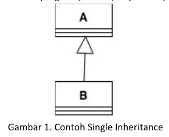

2. Multilevel Inheritance

   Multilevel Inheritance adalah suatu child class bisa menjadi super class bagi class yang lain, contoh:

   

Pada class diagram, pewarisan digambarkan dengan sebuah garis tegas, dengan segitiga di ujungnya. Class yang dekat dengan segitiga merupakan super class, sedangkan class yang jauh dari segitiga merupakan child class, berikut contoh class diagram dari pewarisan:


Access Modifier


Dari tabel diatas dapat kita simpulkan bahwa jika kita ingin menggunakan inheritence, kita harus memperhatikan access modifiernya jika inheritence dalam satu package yang sama dapat menggunakan modifier `default` saja, dan jika ingin lebih bebas dapat menggunakan `protected` ataupun `public`

Kata kunci super dipakai untuk merujuk pada member dari parent class, format penulisannya sebagai berikut:

* **super.namaAtribut**

    Merujuk / mengakses atribut dari parent class / super class

* **super.namaMethod()**

    Merujuk / memanggil method dari parent class / super class

* **super()**

    Merujuk / memanggil konstruktor dari parent class / super class

    `hanya bisa digunakan dibaris pertama dalam konstruktor`

* **super(parameter1, parameter2, dst)**

    Merujuk / memanggil konstruktor berparameter dari parent class / super class

ketika membuat objek dari child class, pada saat itu juga objek pada super class juga akan terbentuk.

## Percobaan

### Percobaan 1

Pada percobaan 1 belajar bagaimana penggunaan extends untuk pewarisan pada java.

`Screenshot Percobaan 1:`

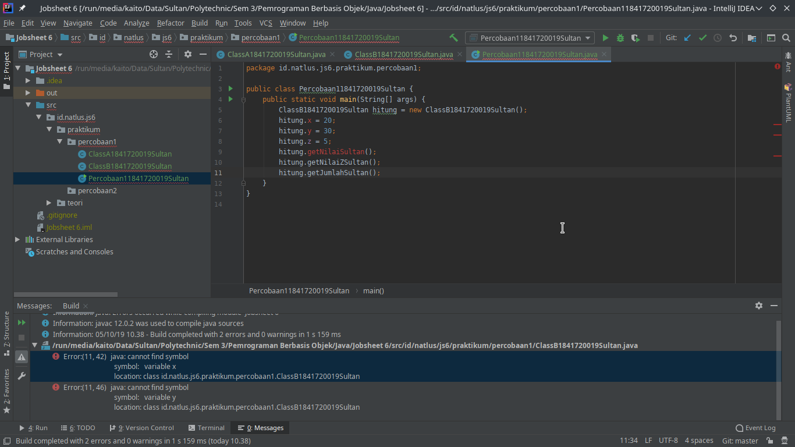

Terlihat pada screenshot diatas terjadi error memang pada percobaan ini sengaja error untuk belajar cara penggunaan extends, untuk penyelesaiannya ada pada `pertanyaan percobaan 1` dibawah.

#### Pertanyaan Percobaan 1

1. Pada percobaan 1 diatas program yang dijalankan terjadi error, kemudian perbaiki sehingga program tersebut bisa dijalankan dan tidak error

   `Jawaban:`

   Memperbaiki error dengan menambahkan `Extends ClassA` pada ClassB

   ```java
    public class ClassB1841720019Sultan extends ClassA1841720019Sultan {
        // Some Code
    }
    ```

    `Screenshot Percobaan 1 yang telah diperbaiki:`

    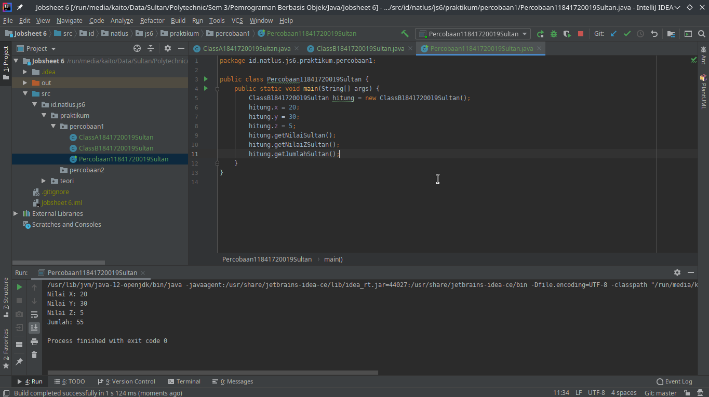

    `Kode Program:`

   * [ClassA1841720019Sultan](../../src/6_Inheritance/percobaan1/ClassA1841720019Sultan.java)
   * [ClassB1841720019Sultan](../../src/6_Inheritance/percobaan1/ClassB1841720019Sultan.java)
   * [Percobaan11841720019Sultan](../../src/6_Inheritance/percobaan1/Percobaan11841720019Sultan.java)

2. Jelaskan apa penyebab program pada percobaan 1 ketika dijalankan terdapat error!

    Penyebab terjadinya error adalah karena ClassB belum mewarisi ClassA tetapi ClassB ingin mengakses variabel / method yang terdapat pada ClassA

### Percobaan 2

Pada percobaan 2 akan belajar tentang hak akses pada saat pewarisan dalam java.

`Screenshot Percobaan 2:`

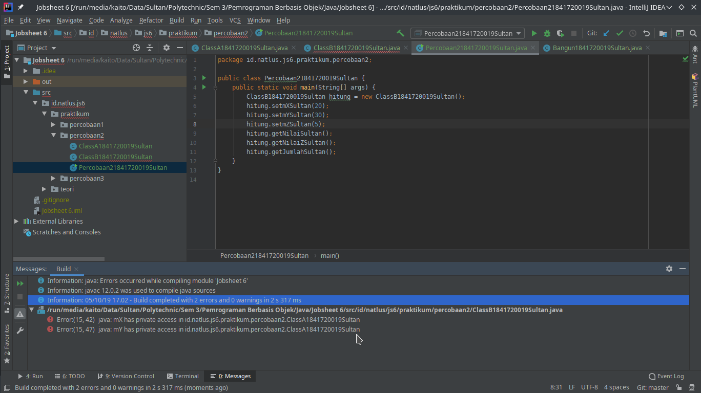

Terlihat pada screenshot diatas terjadi error memang pada percobaan ini sengaja error untuk belajar hak akses pada pewarisan, untuk penyelesaiannya ada pada `pertanyaan percobaan 2` dibawah.

#### Pertanyaan Percobaan 2

1. Pada percobaan 2 diatas program yang dijalankan terjadi error, kemudian perbaiki sehingga program tersebut bisa dijalankan dan tidak error

    `Jawaban:`

    Untuk mengatasi error ini dapat menggunakan beberapa cara mulai dari mengganti access modifier dari variabel x dan y menjadi `protected` atau `public` atau `default (Selama dalam satu package)`, atau menggunakan `getter`, dan lainnya, Kali ini untuk mengatasi error tersebut menggunakan `getter` yang ditambahkan pada ClassA.

    `Screenshot Percobaan 2 yang telah diperbaiki:`

    

    `Kode Program:`

   * [ClassA1841720019Sultan](../../src/6_Inheritance/percobaan2/ClassA1841720019Sultan.java)
   * [ClassB1841720019Sultan](../../src/6_Inheritance/percobaan2/ClassB1841720019Sultan.java)
   * [Percobaan21841720019Sultan](../../src/6_Inheritance/percobaan2/Percobaan21841720019Sultan.java)

2. Jelaskan apa penyebab program pada percobaan 2 ketika dijalankan terdapat error!

    `Jawaban:`

    Penyebab terjadinya error ini dikarenakan access modifier `private`,tidak akan ikut diwariskan pada saat pewarisan, sehingga variabel atau method atau lainnya tidak akan dapat diakses oleh child class, dalam kasus diatas ClassB yang ingin mengakses variabel x dan y dari ClassA tetapi variabel tersebut merupakan variabel yang memiliki access modifier `private` sehingga ClassB tidak dapat mengakses variabel tersebut.

### Percobaan 3

Pada percobaan 3 akan belajar tentang `super` pada pewarisan dalam java.

`Screenshot Percobaan 3:`

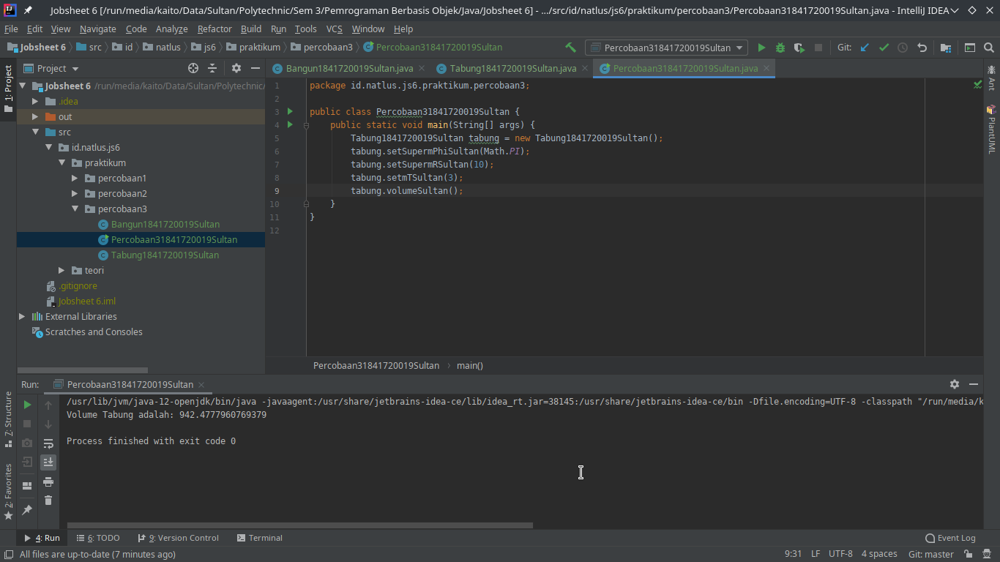

`Kode Program:`

* [Bangun1841720019Sultan](../../src/6_Inheritance/percobaan3/Bangun1841720019Sultan.java)
* [Tabung1841720019Sultan](../../src/6_Inheritance/percobaan3/Tabung1841720019Sultan.java)
* [Percobaan31841720019Sultan](../../src/6_Inheritance/percobaan3/Percobaan31841720019Sultan.java)

#### Pertanyaan Percobaan 3

1. Jelaskan fungsi `super` pada potongan program berikut di class Tabung!

   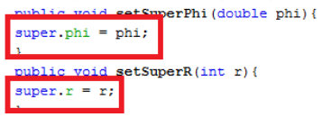

   `Jawab:`

    Fungsi super dalam potongan program diatas berfungsi untuk merujuk pada parent class, dalam gambar diatas, `super.phi` dan `super.r` digunakan untuk mengakses dan mengganti variabel value yang ada pada parent class.

2. Jelaskan fungsi `super` dan `this` pada potongan program berikut di class Tabung

   

   `Jawab:`

    Fungsi `super` dan `this` pada potongan program diatas adalah jika untuk `super.phi` dan `super.r` digunakan untuk mengakses value dari variabel `phi` dan `r` yang ada pada `Class Bangun` sebagai parent class, sedangkan fungsi dari `this.t` adalah untuk merujuk pada variabel global `t` yang ada pada `Class Tabung` itu sendiri.

3. Jelaskan mengapa pada class Tabung tidak dideklarasikan atribut `phi` dan `r` tetapi class tersebut dapat mengakses atribut tersebut

    `Jawab:`

    Karena `Class Tabung` merupakan `child class` dari `Class Bangun`, karena atribut `phi` dan `r` terdapat pada `Class Bangun` sehingga jika `Class Tabung` ingin mengakses atribut atau method atau lainnya dari `Parent Class`nya dapat menggunakan `super`, misal `super.phi` untuk mengakes atribut `phi` dari Parent Class (dengan catatan atribut tersebut **`tidak private`**)

### Percobaan 4

Pada percobaan 4 akan belajar tentang `super constructor` atau `super()` atau `super(parameter1, parameter2, dst)` pada pewarisan dalam java.

`Screenshot Percobaan 4:`

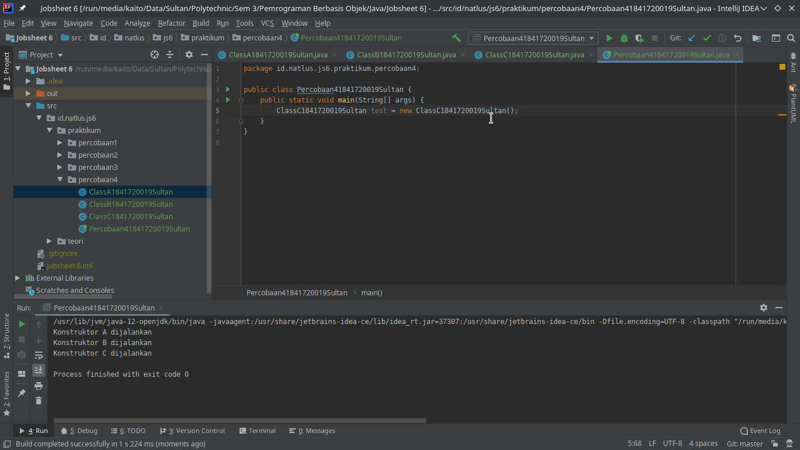

`Kode Program:`

* [ClassA1841720019Sultan](../../src/6_Inheritance/percobaan4/ClassA1841720019Sultan.java)
* [ClassB1841720019Sultan](../../src/6_Inheritance/percobaan4/ClassB1841720019Sultan.java)
* [ClassC1841720019Sultan](../../src/6_Inheritance/percobaan4/ClassC1841720019Sultan.java)
* [Percobaan41841720019Sultan](../../src/6_Inheritance/percobaan4/Percobaan41841720019Sultan.java)

#### Pertanyaan Percobaan 4

1. Pada percobaan 4 sebutkan mana class yang termasuk superclass dan subclass, kemudian jelaskan alasannya!

    `Jawaban:`

    Class yang termasuk `superclass` dan `subclass` adalah `ClassB` karena merupakan subclass dari `ClassA` dan `superclass` dari `ClassC`.

2. Ubahlah isi konstruktor default ClassC seperti berikut

    

    Tambahkan kata `super()` di baris pertama dalam konstruktor defaultnya, coba jalankan kembali class Percobaan4 dan terlihat tidak ada perbedaan dari hasil outputnya!

    `Jawaban:`

    `ya tidak ada perbedaan`

3. Ubahlah isi Konstruktor default ClassC seperti berikut:

    

    Ketika mengubah posisi `super()` dibaris kedua dalam konstruktor defaultnya dan terlihat ada error. kemudian kembalikan `super()` kebaris pertama seperti sebelumnya, maka errornya akan hilang.

    Perhatikan hasil keluaran class Percobaan4 dijalankan, kenapa bisa tampil output seperti berikut pada saat instansiasi objek test dari class ClassC

    

    Jelaskan bagaimana urutan proses jalannya konstruktor saat objek test dibuat.

    `Jawaban:`

    Saat objek `test` dibuat maka otomatis akan menjalankan juga super constructor classnya dalam hal ini objek `test` adalah `ClassC`, `ClassC` adalah child class dari `ClassB` sedangkan `ClassB` adalah child class dari `ClassA`, sehingga saat kita membuat objek dari `ClassC` otomatis akan menjalankan juga `ClassB` dan `ClassA`.

    Urutan proses jalannya konstruktor saat object test dibuat:
    1. Constructor ClassC dijalankan, kemudian memanggil Constructor ClassB

        `Constructor ClassC dijalankan`

        

    2. Constructor ClassB dijalankan, kemudian memanggil Constructor ClassA

        `Constructor ClassB dijalankan`

        

    3. Constructor ClassA dijalankan, kemudian mengeksekusi apa yang terdapat dalam Consctuctor

        `Constructor ClassA dijalankan`

        

        `Eksekusi apa yang terdapat dalam Constructor Class A`

        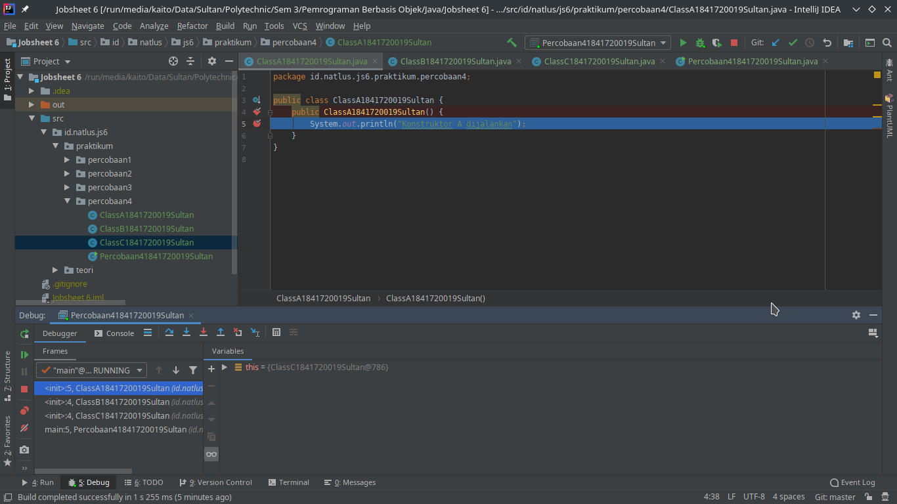

    4. mengeksekusi apa yang terdapat dalam Consctuctor dari ClassB

        `Eksekusi apa yang terdapat dalam Constructor Class B`

        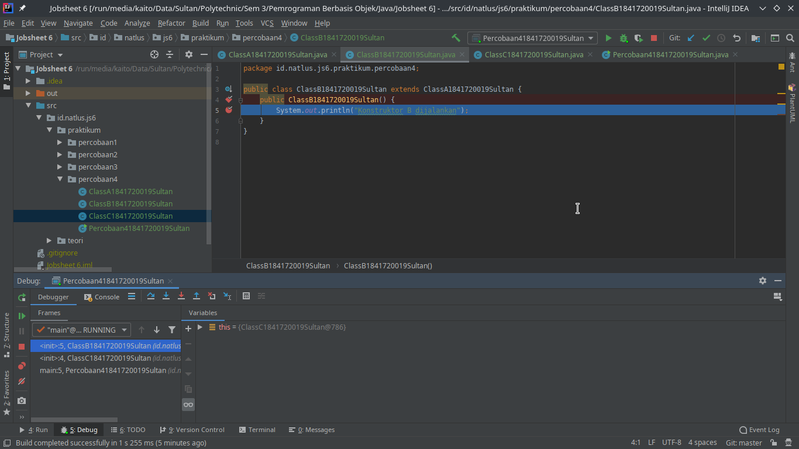

    5. mengeksekusi apa yang terdapat dalam Consctuctor dari ClassC

        `Eksekusi apa yang terdapat dalam Constructor Class C`

        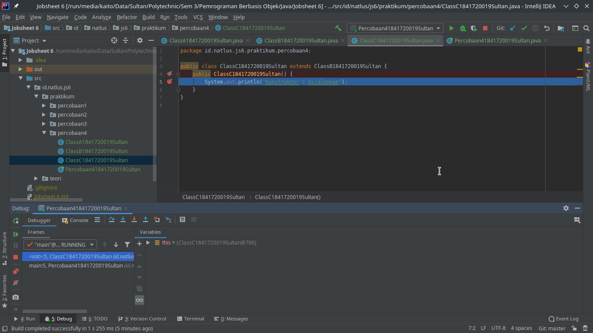

4. Apakah fungsi `super()` pada potongan program dibawah ini di ClassC!

    

    `Jawaban:`

    Fungsi `super()` untuk merujuk atau memanggil konstruktor dari parent class atau super class

### Percobaan 5

Pada percobaan 5 membuat program sesuai jobsheet

`UML:`

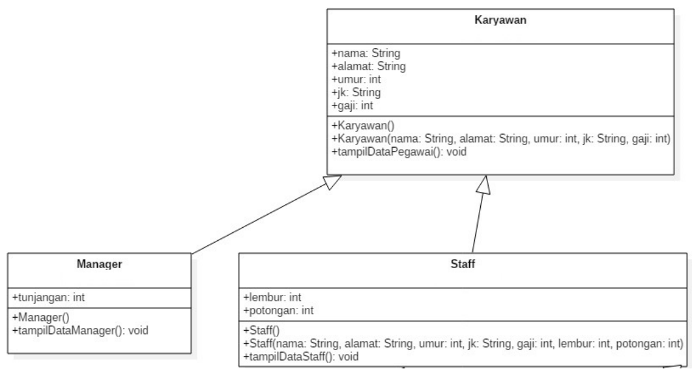

`Screenshot Percobaan 5:`

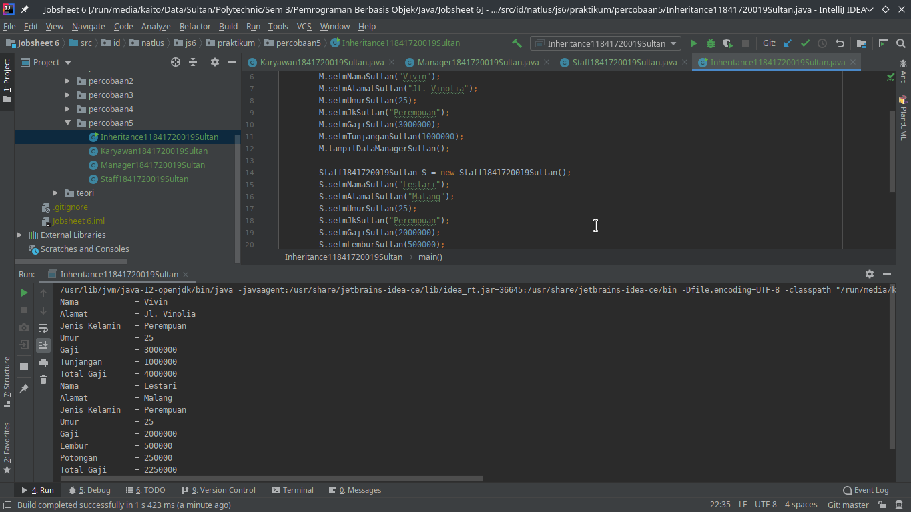

`Kode Program:`

* [Karyawan1841720019Sultan](../../src/6_Inheritance/percobaan5/Karyawan1841720019Sultan.java)
* [Manager1841720019Sultan](../../src/6_Inheritance/percobaan5/Manager1841720019Sultan.java)
* [Staff1841720019Sultan](../../src/6_Inheritance/percobaan5/Staff1841720019Sultan.java)
* [Inheritance11841720019Sultan](../../src/6_Inheritance/percobaan5/Inheritance11841720019Sultan.java)

#### Pertanyaan Percobaan 5

1. Sebutkan class mana yang termasuk super class dan sub class dari percobaan 5 diatas!

    `Jawaban:`

    Sepengetahuan saya untuk class mana yang termasuk `super class` dan `sub class` dari program percobaan 5 diatas **tidak ada**, karena `class Karyawan` hanyalah sebagai `super class` dan `class Manager`, dan `class Staff` sebagai `sub class`
2. Kata kunci apakah yang digunakan untuk menurunkan suatu class ke class yang lain?

    `Jawaban:`

    Kata kuncinya adalah `extends`

    Contoh:

    ```java
    public class B extends A {
        // Contoh Kode Program Class B menjadi child class (Turunan) dari Class A yang sebagai Parent Class
    }
    ```

3. Perhatikan kode program pada class Manager, atribut apa saja yang dimiliki oleh class tersebut? sebutkan atribut mana saja yang diwarisi dari class Karyawan

    `Jawaban:`

    Atribut yang terdapat pada class Manager adalah:
    * mTunjangan : int
    * mNama : String **(Pewarisan dari class Karyawan)**
    * mAlamat : String **(Pewarisan dari class Karyawan)**
    * mJk : String **(Pewarisan dari class Karyawan)**
    * mUmur : int **(Pewarisan dari class Karyawan)**
    * mGaji : int **(Pewarisan dari class Karyawan)**

    `DISCLAIMER`

    ***Saya menjawab sesuai dengan screenshot jobsheet, file program kepemilikan saya agak berbeda, jika pada jobsheet atribut menggunakan access modifier `public` sedangkan saya menggunakan access modifier `private`***

4. Jelaskan kata kunci `super` pada potongan program dibawah ini terdapat pada class Manager

    

    `Jawaban;`

    Kata kunci `super` digunakan untuk merujuk pada parent class

5. Program pada percobaan 5 diatas termasuk dalam jenis inheritance apa? jelaskan alasannya!

    `Jawaban:`

    Program pada percobaan 5 diatas termasuk dalam `Hierarchical Inheritance` dikarenakan `Class Karyawan` diwariskan ke banyak sub class yaitu `Class Manager` dan `Class Staff`

    Contoh lain dari `Hierarchical Inheritance`

    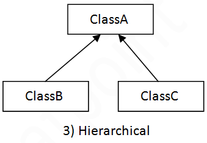

### Percobaan 6

Pada percobaan 6 membuat program sesuai jobsheet

`UML:`

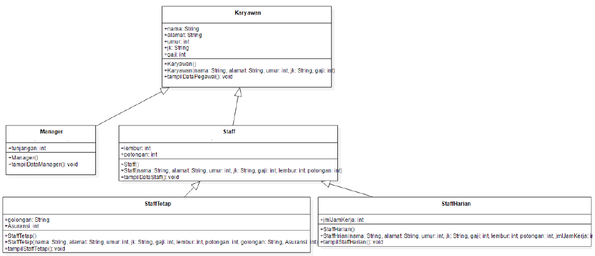

`Screenshot Percobaan 6:`

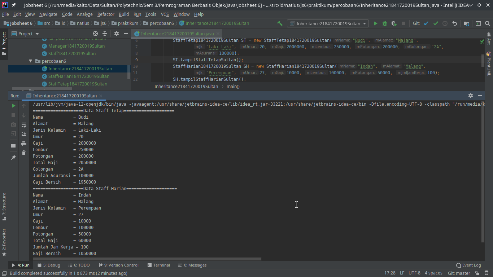

`Kode Program:`

* [Karyawan1841720019Sultan](../../src/6_Inheritance/percobaan5/Karyawan1841720019Sultan.java)
* [Manager1841720019Sultan](../../src/6_Inheritance/percobaan5/Manager1841720019Sultan.java)
* [Staff1841720019Sultan](../../src/6_Inheritance/percobaan5/Staff1841720019Sultan.java)
* [StaffTetap1841720019Sultan](../../src/6_Inheritance/percobaan6/Staff1841720019Sultan.java)
* [StaffHarian1841720019Sultan](../../src/6_Inheritance/percobaan6/Staff1841720019Sultan.java)
* [Inheritance11841720019Sultan](../../src/6_Inheritance/percobaan6/Inheritance11841720019Sultan.java)

#### Pertanyaan Percobaan 6

1. Berdasarkan class diatas manakah yang termasuk single inheritance dan mana yang termasuk multilevel inheritance

    `Jawaban:`

    Menurut saya yang termasuk Single Inheritance adalah dari `Class Manajer` ke `Class Karyawan`, sedangkan multilevel Inheritance adalah dari `Class StaffTetap` atau `Class StaffHarian` menuju `Class Karyawan` yang terlebih dahulu melewati `Class Staff`

2. Perhatikan kode program class `StaffTetap` dan `StaffHarian`, atribut apa saja yang dimiliki oleh class tersebut? Sebutkan atribut mana saja yang diwarisi dari `class Staff`

    `Jawaban:`

    1. StaffTetap
       1. mGolongan : String
       2. mAsuransi : int
       3. mLembur : int **(Pewarisan dari class Staff)**
       4. mPotongan : int **(Pewarisan dari class Staff)**
       5. mNama : String **(Pewarisan dari class Staff yang Diwariskan dari Class Karyawan)**
       6. mAlamat : String **(Pewarisan dari class Staff yang Diwariskan dari Class Karyawan)**
       7. mJk : String **(Pewarisan dari class Staff yang Diwariskan dari Class Karyawan)**
       8. mUmur : int **(Pewarisan dari class Staff yang Diwariskan dari Class Karyawan)**
       9. mGaji : int **(Pewarisan dari class Staff yang Diwariskan dari Class Karyawan)**
    2. StaffHarian
       1. mJmlJamKerja : int
       2. mLembur : int **(Pewarisan dari class Staff)**
       3. mPotongan : int **(Pewarisan dari class Staff)**
       4. mNama : String **(Pewarisan dari class Staff yang Diwariskan dari Class Karyawan)**
       5. mAlamat : String **(Pewarisan dari class Staff yang Diwariskan dari Class Karyawan)**
       6. mJk : String **(Pewarisan dari class Staff yang Diwariskan dari Class Karyawan)**
       7. mUmur : int **(Pewarisan dari class Staff yang Diwariskan dari Class Karyawan)**
       8. mGaji : int **(Pewarisan dari class Staff yang Diwariskan dari Class Karyawan)**

3. Apakah fungsi potongan program berikut pada class `StaffHarian`

    

    `Jawaban:`

    fungsi `super(parameter1, parameter2, dst)` digunakan untuk mengakes constructor berparameter dari parent class.

4. Apakah fungsi potongan program berikut pada class `StaffHarian`

    

    `Jawaban:`

     fungsi `super.CallMethod()` digunakan untuk memanggil method dari parent class.

5. Perhatikan kode program dibawah ini yang terdapat pada class `StaffTetap`

    

    Terlihat dipotongan program diatas atribut gaji, lembur, dan potongan dapat diakses langsung, kenapa hal ini bisa terjadi dan bagaimana class `StaffTetap` memiliki atribut gaji, lembur, dan potongan padahal dalam class tersebut tidak dideklrasaikan atribut gaji, lembur, dan potongan?

    `Jawaban:`

    Karena access modifier pada atribut tersebut di jobsheet menggunakan `public` sehingga dapat diakses langsung, class `StaffTetap` merupakan child class dari class `Staff` yang merupakan child class dari class `Karyawan` sehingga class `StaffTetap` yang merupakan child class dapat mengakes atribut yang dimiliki oleh parent classnya.

## Tugas

Buatlah sebuah program dengan konsep pewarisan seperti pada class diagram berikut ini, Kemudian buatlah instansiasi objek untuk menampilkan data pada class Mac, Windows, dan PC!

`UML:`

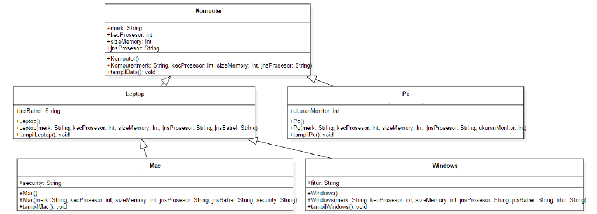

`Screenshot:`

`Kode Program:`

## Kesimpulan

Kesimpulan yang saya dapat setelah menyelesaikan Percobaan, Pertanyaan, dan Tugas diatas adalah :

1. Saya mampu memahami konsep dasar inheritance atau pewarisan.
2. Saya mampu membuat suatu subclass dari suatu superclass tertentu.
3. Saya mampu mengimplementasikan konsep single dan multilevel inheritance.
4. Saya mampu membuat objek dari suatu subclass dan melakukan pengaksesan terhadap atribut dan method baik yang dimiliki sendiri atau turunan dari superclass nya.

## Pernyataan Diri

Saya menyatakan isi tugas, kode program, dan laporan praktikum ini dibuat oleh saya sendiri. Saya tidak melakukan plagiasi, kecurangan, menyalin/menggandakan milik orang lain.

Jika saya melakukan plagiasi, kecurangan, atau melanggar hak kekayaan intelektual, saya siap untuk mendapat sanksi atau hukuman sesuai peraturan perundang-undangan yang berlaku.

Ttd,

***Sultan Achmad Qum Masykuro NS***
